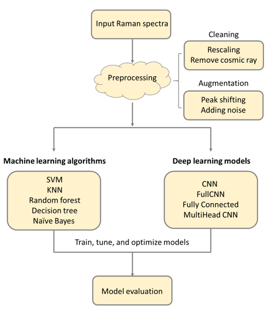

# Raman_deep_learning
This project focuses on applying machine learning and deep learning techniques to classify graphene Raman spectroscopic data

This work is published on [arXiv](https://arxiv.org/abs/2203.00431)


### Overview


The impact of the environment on graphene's properties such as strain, charge density, and dielectric environment can be evaluated by Raman spectroscopy. Variations, artifacts, and environmental differences pose a challenge in traditional spectral analysis. In this work, we developed a deep learning model to overcome the effects of such variations and classify graphene Raman spectra according to different charge densities and dielectric environments. We demonstrated the spectra classification with 99% accuracy using a convolutional neural net (CNN) model. Our approach has the potential for fast and reliable estimation of graphene doping levels and dielectric environments. The proposed model paves the way for achieving efficient analytical tools to evaluate the properties of graphene. 

### Schematic of collecting data and prediction


### Flowchart of this work
- Before feeding the data into any models, it is rescaled and cosmic rays are removed. 
- To capture all expected variations in the collected spectra, we make use of data augmentation. This includes peak shifting and additive noise (5 different noise levels). 
- 5 different machine learning models (SVM, RF, KNN, DT, NB) and 4 different deep learning models (CNN, FullCNN, FC, and MHCNN) are implemented. 
- All the models are trained, tuned, and optimized and the optimal performances are compared. 



### Machine Learning Performance


### Deep Learning Performance


Please refer to our paper for more details

### How to use
Clone our repository using the following
```
git clone https://github.com/zhuofachen/Raman_deep_learning.git
```

- To run the Machine Learning models, please refer to `src/machine_learning_src/machine_learning_models_applications.ipynb`
- To run the Deep Learning models, please refer to `src/deep_learning_src/CNN_Benchmarks.ipynb`
